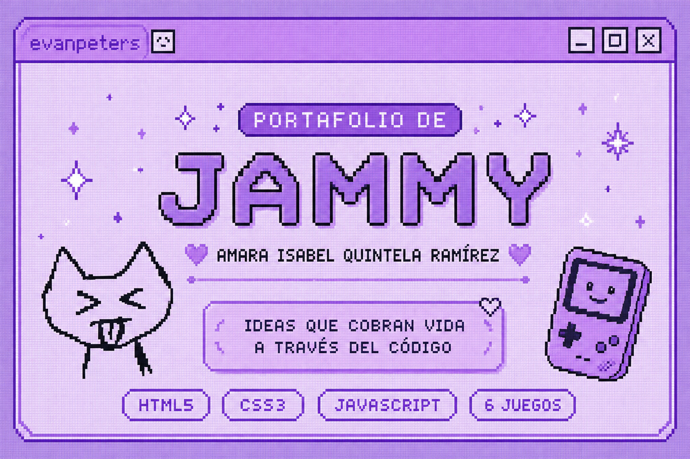

<p align="center">
  
</p>

<h1 align="center">🎮 Portafolio de Game Development — Jammy</h1>

<p align="center">
  <i>Ideas que cobran vida a través del código.</i>
</p>

<p align="center">
  
  
  
</p>

<p align="center">
  <a href="https://github.com/Jammy-QRA">
    
  </a>
</p>

---

## 👾 Sobre mí

Soy **Amara Isabel Quintela Ramirez**, estudiante de **Ingeniería en Sistemas Informáticos** e interesada en la programación, el desarrollo de software y la creación de experiencias interactivas.

Este repositorio reúne seis juegos desarrollados como parte de mi proceso de aprendizaje en **Game Development**. Cada proyecto explora una mecánica diferente y busca utilizar los videojuegos como una forma de aprender, reflexionar o desarrollar hábitos mediante la interacción.

Mi enfoque con estos proyectos ha sido experimentar con ideas, resolver problemas mediante código y transformar conceptos en experiencias jugables utilizando tecnologías web.

---

# 🕹️ Galería de proyectos

Cada juego es un proyecto independiente desarrollado con **HTML5, CSS3 y JavaScript**.

---

## 🎮 01 — Math Quest

<p align="center">
  
</p>

**Aventura 2D / Educativo** · HTML5, CSS3, JavaScript

Una aventura 2D en la que el jugador recorre un mundo inspirado en los clásicos juegos de exploración mientras encuentra señales que presentan desafíos matemáticos.

A lo largo de la partida debe responder correctamente **10 preguntas** de suma, resta, multiplicación y división. Si supera los desafíos, obtiene el **Cristal del Conocimiento**.

 **Objetivo:** Reforzar habilidades matemáticas mediante una experiencia interactiva y entretenida.

📂 [Ver proyecto](games/01-math-quest)

---

## 🍎 02 — Comida al Toque

<p align="center">
 
</p>

**Arcade / Educativo** · HTML5, CSS3, JavaScript

Desde la parte superior de la pantalla caen diferentes alimentos y el jugador debe reaccionar rápidamente para recoger los alimentos saludables mientras evita la comida chatarra.

El juego utiliza un sistema de vida y, además, explica por qué determinados alimentos pueden ser poco saludables cuando el jugador los recoge.

 **Objetivo:** Promover conocimientos sobre alimentación saludable mediante una mecánica rápida y dinámica.

📂 [Ver proyecto](games/02-comida-al-toque)

---

## ♻️ 03 — Tinder Trash

<p align="center">

</p>

**Puzzle / Educativo** · HTML5, CSS3, JavaScript

Un juego basado en la mecánica de **arrastrar y soltar**, donde el jugador debe clasificar correctamente diferentes tipos de residuos.

Las tarjetas representan objetos como plástico, vidrio, papel, metal y basura común. Cada decisión correcta permite avanzar, mientras que los errores o el exceso de tiempo hacen perder vidas.

 **Objetivo:** Enseñar a identificar y clasificar correctamente distintos tipos de residuos.

📂 [Ver proyecto](games/03-tinder-trash)

---

## 💬 04 — Detrás del Muro

<p align="center">

</p>

**Storytelling / Decisiones / Educativo** · HTML5, CSS3, JavaScript

Una experiencia narrativa interactiva centrada en el **cyberbullying**.

El jugador observa la situación desde diferentes perspectivas y toma decisiones que afectan el desarrollo de la historia. Posteriormente puede conocer cómo determinadas acciones repercuten en la persona que las recibe.

No existe una forma tradicional de ganar o perder: el propósito es mostrar que las decisiones digitales también pueden tener consecuencias reales.

 **Objetivo:** Generar reflexión sobre el impacto de nuestras acciones en situaciones de cyberbullying.

📂 [Ver proyecto](games/04-detras-del-muro)

---

## 💧 05 — Reto Gota

<p align="center">
 
</p>

**Minijuegos / Arcade / Educativo** · HTML5, CSS3, JavaScript

Una colección de minijuegos rápidos en los que el jugador debe resolver diferentes desafíos relacionados con el uso responsable del agua.

Cada reto tiene un límite de tiempo y el jugador debe administrar cuidadosamente los recursos disponibles para conseguir la mejor puntuación posible.

 **Objetivo:** Promover hábitos responsables sobre el consumo y gestión del agua mediante desafíos interactivos.

📂 [Ver proyecto](games/05-reto-gota)

---

## 💰 06 — El Ministerio del Invierno

<p align="center">
 
</p>

**Simulación / Decisiones / Educativo** · HTML5, CSS3, JavaScript

Un juego de simulación centrado en la **gestión del dinero y la toma de decisiones**.

El jugador debe trabajar y resolver diferentes tareas para obtener ingresos. Al finalizar cada jornada debe decidir cómo distribuir su dinero entre necesidades como alimentación, calefacción y vivienda.

Las decisiones tienen consecuencias: una mala administración puede afectar directamente el desarrollo de la partida.

 **Objetivo:** Enseñar conceptos básicos de educación financiera y administración de recursos mediante una experiencia interactiva.

📂 [Ver proyecto](games/06-ministerio-del-invierno)

---

# 🛠️ Stack general

<p align="center">


</p>

Los seis juegos fueron desarrollados utilizando **HTML5, CSS3 y JavaScript vainilla**, sin frameworks. Cada proyecto utiliza estas tecnologías para construir la interfaz, implementar las mecánicas de juego y controlar la interacción del jugador.

---

#  Lo que he explorado

Desarrollar estos juegos me permitió experimentar con diferentes conceptos y mecánicas:

*  Diseño e implementación de mecánicas de juego.
*  Resolución de problemas mediante lógica de programación.
*  Temporizadores, límites de tiempo y sistemas de puntuación.
*  Sistemas de vidas, estados de victoria y derrota.
*  Interacciones mediante clic, movimiento y arrastrar y soltar.
*  Narrativa interactiva y toma de decisiones.
*  Diseño de interfaces y experiencia de usuario.
*  Gestión de recursos y progreso del jugador.
*  Gamificación aplicada al aprendizaje y la concientización.

---

# 📂 Estructura del repositorio

```text
Jammy_game_dev_repository/
│
├── assets/
│   └── banner.png
│
├── games/
│   ├── 01-math-quest/
│   ├── 02-comida-al-toque/
│   ├── 03-tinder-trash/
│   ├── 04-detras-del-muro/
│   ├── 05-reto-gota/
│   └── 06-ministerio-del-invierno/
│
└── README.md
```

Cada carpeta dentro de `games/` contiene un proyecto independiente junto con sus recursos y capturas correspondientes.

---

#  Sobre este portafolio

Este portafolio representa parte de mi proceso de aprendizaje y crecimiento como desarrolladora.

Cada juego comenzó con una idea y se convirtió en una oportunidad para experimentar con diferentes mecánicas, enfrentar problemas y buscar soluciones mediante código.

Mi objetivo es continuar desarrollando proyectos cada vez más completos y seguir explorando la combinación entre:

> **Tecnología · Creatividad · Interacción · Aprendizaje**

---

#  Contacto

<p align="center">

💻 **GitHub:** [Jammy-QRA](https://github.com/Jammy-QRA)

</p>

---

<p align="center">

### ⭐ Gracias por visitar mi portafolio

> *Cada juego comienza con una idea.*
> *El código es lo que la convierte en una experiencia.*

**🎮 Keep coding. Keep creating. 💜**

</p>
