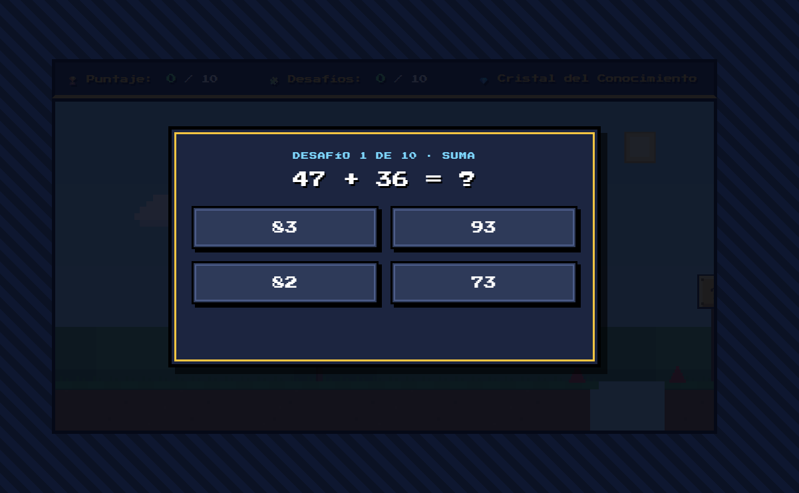

# 🧮 Math Quest

## 🎮 Descripción del juego

**Math Quest** es un videojuego educativo basado en desafíos matemáticos donde el jugador debe resolver diferentes operaciones antes de que termine el tiempo.

El objetivo principal es poner a prueba la rapidez mental y la capacidad de resolución de problemas mediante una experiencia interactiva y dinámica.

---

## 🕹️ Cómo jugar

1. Inicia el juego.
2. Observa la operación matemática mostrada en pantalla.
3. Selecciona la respuesta correcta entre las opciones disponibles.
4. Obtén puntos por cada respuesta acertada.
5. Intenta conseguir la mayor puntuación posible antes de que termine el tiempo.

---

## ✨ Características

- ✅ Sistema de preguntas matemáticas aleatorias.
- ✅ Temporizador para aumentar la dificultad.
- ✅ Sistema de puntuación.
- ✅ Interfaz interactiva.
- ✅ Retroalimentación según las respuestas del jugador.

---

## 🛠️ Tecnologías utilizadas

- HTML5
- CSS3
- JavaScript

---

##  Estructura del proyecto

```
01-math-quest
│
├── project
│   ├── index.html
│   ├── script.js
│   └── style.css
│
└── assets
    └── screenshots
        ├── pantalla inicio.png
        ├── pregunta.png
        └── pantalla final.png
```

---

##  Capturas del juego

### Pantalla inicial


### Gameplay




### Pantalla final


---

##  Ejecutar el proyecto

Para ejecutar el juego localmente:

1. Descargar o clonar el repositorio.
2. Abrir la carpeta:

```
project
```

3. Ejecutar el archivo:

```
index.html
```

4. Jugar desde el navegador.

---

##  Jugar online

Puedes probar el juego directamente desde GitHub Pages:

 [Jugar Math Quest](https://jammy-qra.github.io/Jammy_game_dev_repository/games/01-math-quest/project/)

---

##  Autora

**Jammy-QRA**

Proyecto desarrollado como parte del aprendizaje en desarrollo de videojuegos utilizando tecnologías web.
