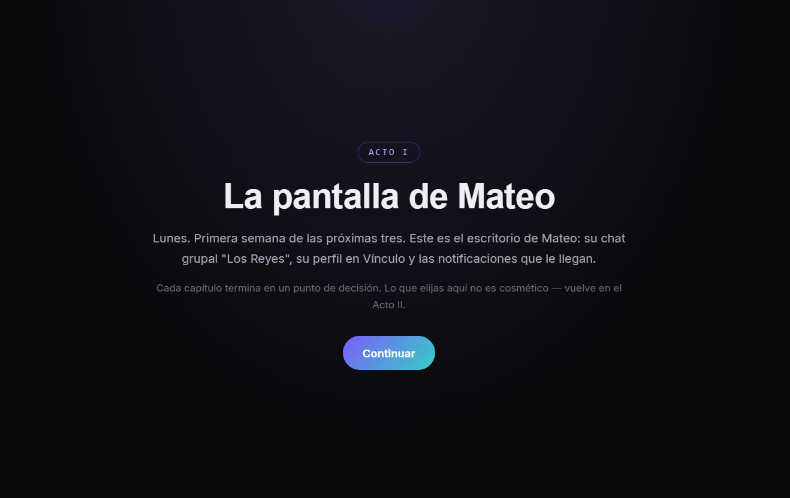
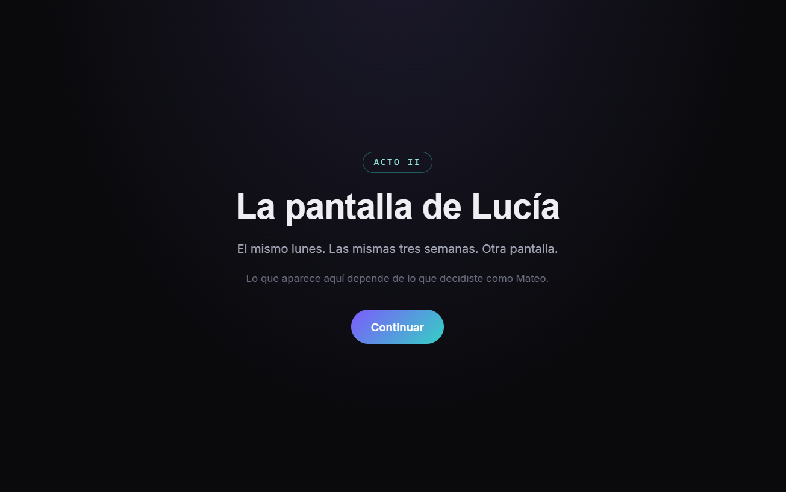
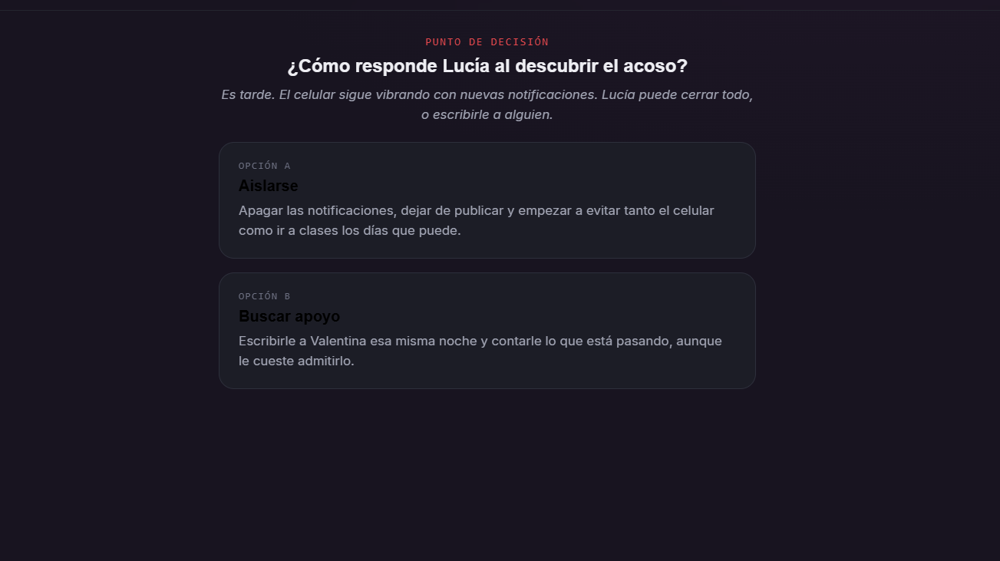
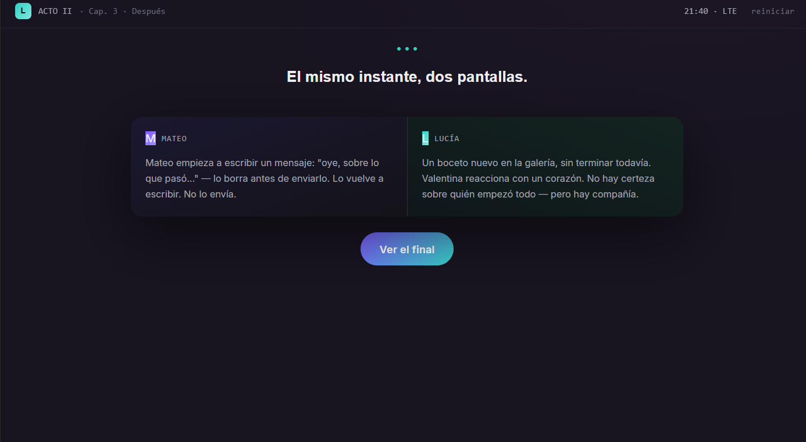
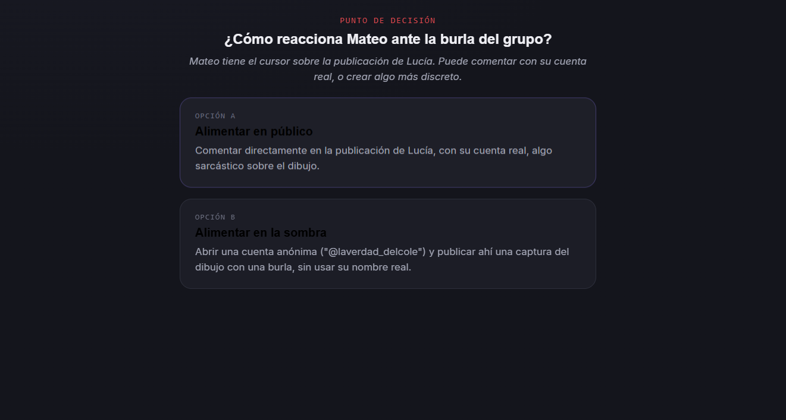
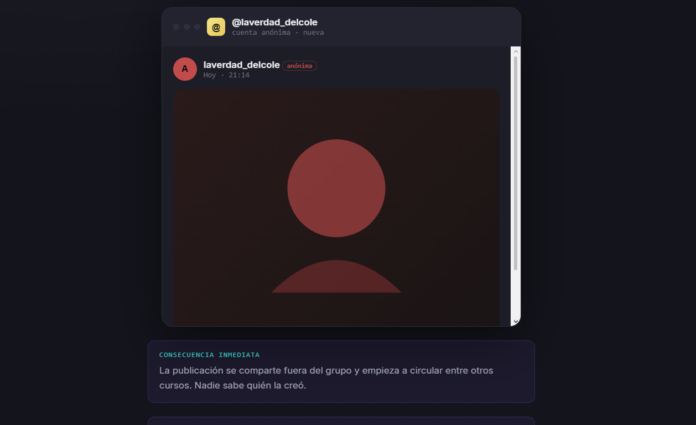

# 🚪 Detrás del Muro

## 🎮 Descripción del juego

**Detrás del Muro** es un videojuego interactivo de exploración y descubrimiento donde el jugador debe avanzar a través de una experiencia narrativa basada en decisiones.

El objetivo del juego es descubrir qué se encuentra detrás del muro, explorando diferentes situaciones y tomando acciones que permiten avanzar dentro de la historia.

Este proyecto está enfocado en la creación de una experiencia interactiva donde la curiosidad y la toma de decisiones forman parte de la jugabilidad.

---

## 🕹️ Cómo jugar

1. Inicia el juego desde la pantalla principal.
2. Explora las diferentes escenas disponibles.
3. Interactúa con los elementos del entorno.
4. Toma decisiones para avanzar en la experiencia.
5. Descubre el resultado final de la historia.

---

## ✨ Características

- ✅ Experiencia interactiva basada en exploración.
- ✅ Narrativa visual.
- ✅ Sistema de interacción con elementos del juego.
- ✅ Diferentes pantallas y escenas.
- ✅ Ambientación enfocada en misterio y descubrimiento.

---

## 🛠️ Tecnologías utilizadas

- HTML5
- CSS3
- JavaScript

---

##  Estructura del proyecto

```
04-detras-del-muro
│
├── project
│   └── detras-del-muro.html
│
└── assets
    └── screenshots
        ├── detras del muro inicio.png
        ├── ddm1.png
        ├── ddm2.png
        ├── ddm3.png
        ├── ddm4.png
        ├── ddm5.png
        ├── ddm6.png
        ├── ddm fin1.png
        └── detras del muro final.png
```

---

##  Capturas del juego

### Pantalla inicial


### Desarrollo del juego














### Final del juego


---

##  Ejecutar el proyecto

Para ejecutar el juego localmente:

1. Descargar o clonar el repositorio.
2. Entrar en la carpeta:

```
project
```

3. Ejecutar el archivo:

```
detras-del-muro.html
```

4. Abrirlo en un navegador web.

---

##  Jugar online

Puedes probar el juego directamente desde GitHub Pages:

 [Jugar Detrás del Muro](https://jammy-qra.github.io/Jammy_game_dev_repository/games/04-detras-del-muro/project/detras-del-muro.html)

---

## 👨‍💻 Autora

**Jammy-QRA**

Proyecto desarrollado como parte del aprendizaje en desarrollo de videojuegos utilizando tecnologías web.
